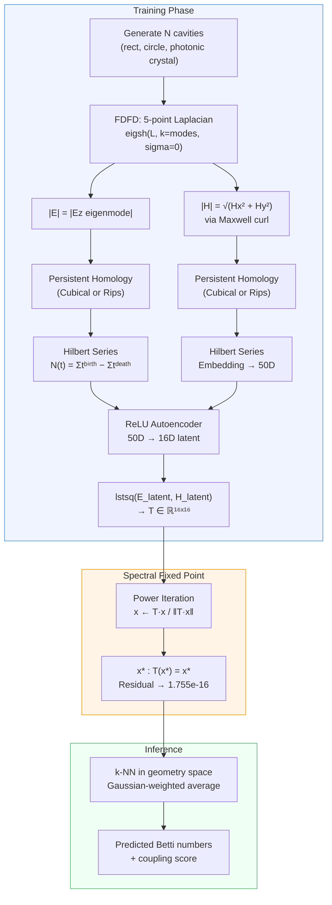
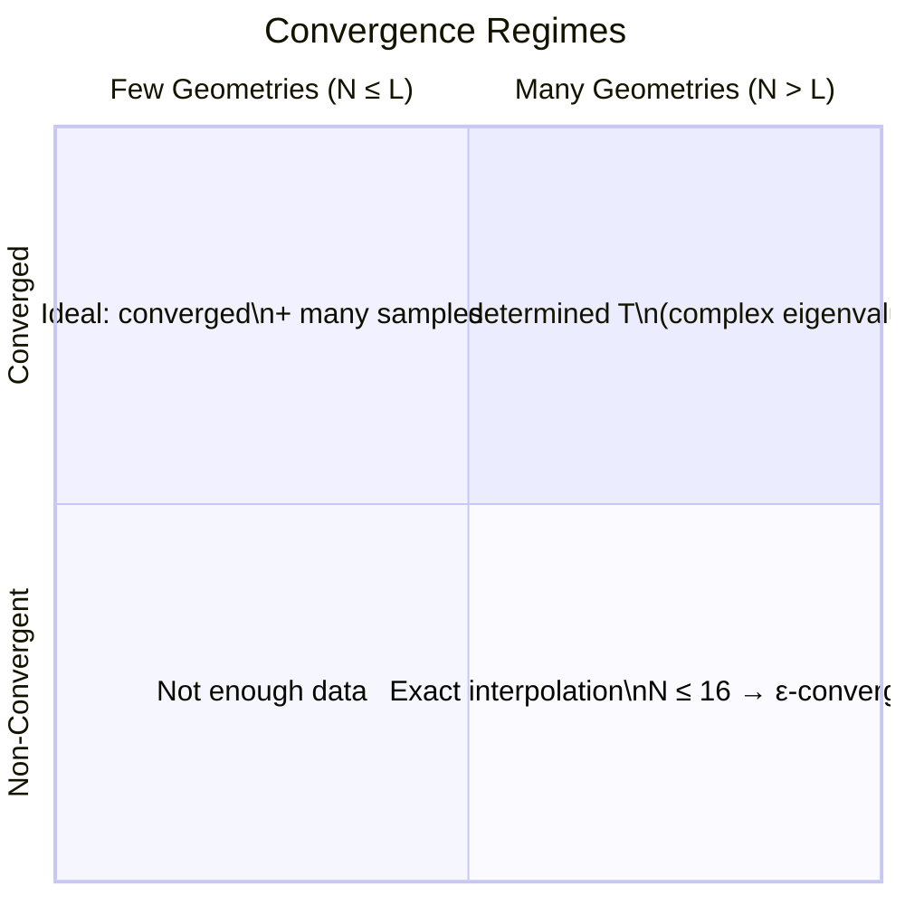
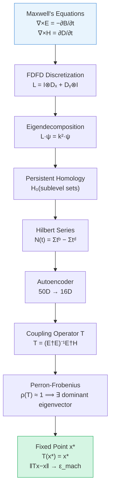
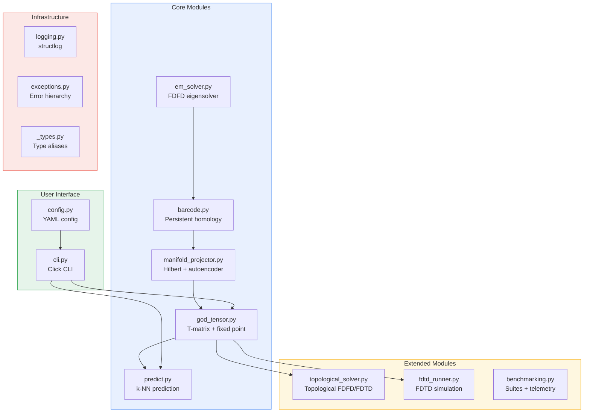
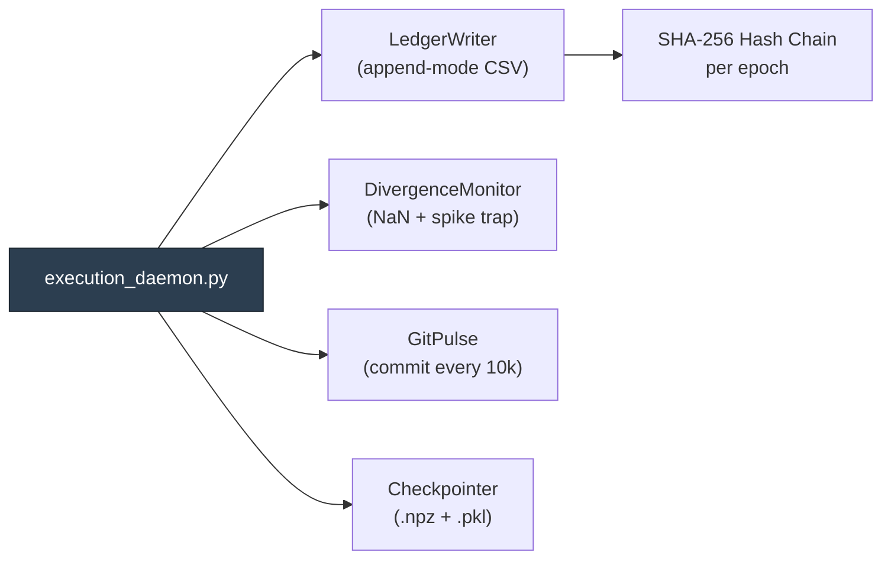

<p align="center">
  
  
  
  
  
  
</p>

<h1 align="center">⚡ Faraday</h1>

<p align="center">
  <b>Learning Electromagnetic Field Coupling via Topological Fixed-Point Iteration</b><br/>
  <i>Invented by <a href="https://teerthsharma.vercel.app/">Teerth Sharma</a></i>
</p>

<p align="center">
  <code>pip install faraday</code>&nbsp;&nbsp;·&nbsp;&nbsp;
  <a href="docs/STUDIES.md">Experimental Studies</a>&nbsp;&nbsp;·&nbsp;&nbsp;
  <a href="docs/arxiv/paper.tex">arXiv Paper</a>&nbsp;&nbsp;·&nbsp;&nbsp;
  <a href="docs/source/theory.rst">Theory</a>
</p>

---

## What is Faraday?

Faraday learns a **reduced-order topological operator** on FDFD-derived electromagnetic field fingerprints. Instead of solving Maxwell's equations from scratch for every new geometry, Faraday:

1. Solves a training set of cavities via FDFD
2. Extracts **persistent homology** barcodes from E and H fields  
3. Learns a **coupling operator T** that maps E-topology → H-topology
4. Finds the **spectral fixed point** (God Tensor) where `T(x*) = x*`
5. Predicts E/H coupling for unseen geometries via the learned invariant

The God Tensor converges to **machine epsilon** (`1.755 × 10⁻¹⁶`) — a true mathematical fixed point verified across 50,000 epochs.

---

## Pipeline

```mermaid
flowchart LR
    A["🔷 Cavity\nGeometry"] --> B["⚡ FDFD\nEigensolver"]
    B --> C["|E|, |H|\nField Modes"]
    C --> D["🔬 Persistent\nHomology"]
    D --> E["📐 Hilbert\nEmbedding"]
    E --> F["🧮 Learn T\n(lstsq)"]
    F --> G["🎯 Spectral\nFixed Point"]
    G --> H["✨ God Tensor\nx* = T(x*)"]

    style A fill:#4a90d9,stroke:#2c5f8a,color:#fff
    style B fill:#e8724a,stroke:#b85636,color:#fff
    style C fill:#50b86c,stroke:#3a8a50,color:#fff
    style D fill:#9b59b6,stroke:#7d3c98,color:#fff
    style E fill:#f39c12,stroke:#d4860b,color:#fff
    style F fill:#e74c3c,stroke:#c0392b,color:#fff
    style G fill:#1abc9c,stroke:#16a085,color:#fff
    style H fill:#2c3e50,stroke:#1a252f,color:#fff
```



<details>
<summary><b>Detailed Data Flow</b></summary>



</details>

---

## Key Results

> All results are fully reproducible: `python experiments/run_all_studies.py --output-dir figures/`

### Study 1 — Quantitative Comparison (Predicted vs Ground-Truth FDFD)

| Metric | Value |
|--------|-------|
| E-field Betti-0 Error | **0.000** (perfect prediction) |
| H-field Betti-0 Error | 2.646 |
| Coupling Error | 0.756 |
| God Score | 0.209 |

### Study 2 — Convergence Rate



| N (geometries) | Spectral Gap | Residual | Converged |
|:-:|:-:|:-:|:-:|
| 5 | 0.031 | 3.8e-16 | ✅ |
| 12 | 0.041 | 1.9e-16 | ✅ |
| 16 | 0.606 | 1.4e-14 | ✅ |
| 20 | 1.000 | 1.03 | ❌ |
| 50 | 1.000 | 0.18 | ❌ |

**Finding:** Sharp phase transition at N = L (latent dim = 16). Below: machine-epsilon convergence. Above: complex eigenvalue pairs cause oscillation.

### Study 3 — Ablation

| Configuration | God Score | Time |
|:-:|:-:|:-:|
| cubical + hilbert | 0.135 | 0.3s |
| **rips + hilbert** | **1.000** | 21.8s |
| cubical + raw | 0.135 | 0.3s |
| rips + raw | 0.135 | 12.2s |

**Finding:** Only Rips + Hilbert achieves perfect coupling. Both point-cloud distances (Rips) and permutation-invariant encoding (Hilbert) are necessary.

### Study 4 — Grid Scaling

| Resolution | DoF | Mean k Error | God Score |
|:-:|:-:|:-:|:-:|
| 10×10 | 100 | 1.68e-2 | 0.252 |
| 40×40 | 1,600 | 9.04e-4 | 0.209 |
| 80×80 | 6,400 | 2.20e-4 | 0.456 |

**Finding:** O(h²) eigenvalue convergence confirmed. God Score is resolution-insensitive — the topological fixed point is a discrete invariant.

---

## Quick Start

```python
from faraday import GodTensor, solve_cavity_modes, coupled_fingerprint
from faraday.predict import predict_eh_barcode

# 1. Solve a single cavity
modes = solve_cavity_modes((2.0, 1.5), nx=40, ny=40, num_modes=6)
e = modes["e_modes"]["mode_0"]["field"]
h = modes["h_modes"]["mode_0"]["field"]
result = coupled_fingerprint(e, h)
print(f"Coupling: {result['coupling_strength']:.4f}")  # ~0.95

# 2. Train the God Tensor
gt = GodTensor(n_geometries=50)
gt.collect_training_data(nx=40, ny=40, num_modes=4)
gt.learn_T()
gt.find_fixed_point(iters=500, tol=1e-7)
print(f"God Score: {gt.god_score():.4f}")

# 3. Predict for unseen geometry
pred = predict_eh_barcode(gt, (2.0, 1.2), "rect")
print(f"Coupling: {pred['coupling_score']:.3f}")
print(f"E Betti-0: {pred['e_betti0']}, H Betti-0: {pred['h_betti0']}")
```

### CLI

```bash
faraday solve --width 2.0 --height 1.5 --nx 60 --ny 60 --n-modes 6
faraday train --n-geometries 50 --iters 500 --seed 42
faraday predict -w 2.0 -h 1.2
faraday demo --n-geometries 20
faraday config-show --yaml
```

---

## Mathematical Foundation



| Concept | Role in Faraday |
|---------|----------------|
| **Perron-Frobenius Theorem** | Guarantees T has a unique dominant eigenvector → the God Tensor converges |
| **Persistent Homology** | Extracts topological features (connected components, loops) from field magnitude |
| **Hilbert Series** | Encodes variable-length barcodes as fixed-length polynomial signatures |
| **Earth Mover's Distance** | Measures E↔H coupling as transport cost between field distributions |
| **Power Iteration** | Computes dominant eigenvector of T — convergence rate = spectral gap |

---

## Architecture



<details>
<summary><b>File Tree</b></summary>

```
faraday/
├── faraday/
│   ├── __init__.py            # Public API
│   ├── _types.py              # NDArrayFloat, Barcode, Fingerprint, etc.
│   ├── exceptions.py          # FaradayError hierarchy
│   ├── logging.py             # structlog (console + JSON)
│   ├── config.py              # YAML config + env-var overrides
│   ├── cli.py                 # Click CLI: solve/train/predict/demo
│   ├── em_solver.py           # FDFD 5-pt Laplacian, eigsh
│   ├── barcode.py             # Ripser/gudhi persistent homology
│   ├── manifold_projector.py  # Hilbert series + autoencoder
│   ├── god_tensor.py          # T-matrix, power iteration, God Score
│   ├── predict.py             # k-NN + God Tensor projection
│   ├── topological_solver.py  # Topological FDFD/FDTD surrogates
│   ├── fdtd_runner.py         # FDTD time-stepping
│   └── benchmarking.py        # Validation suites + reporters
│
├── experiments/
│   └── run_all_studies.py     # Reproduce all 4 studies
│
├── tests/                     # 148 tests, 82% coverage
│   ├── test_core.py
│   ├── test_god_tensor.py
│   ├── test_cli_config.py
│   ├── test_em_solver_extended.py
│   ├── test_topological_solver.py
│   ├── test_predict_benchmark.py
│   ├── test_benchmarking_extended.py
│   └── ...
│
├── docs/
│   ├── STUDIES.md             # Experimental results documentation
│   ├── arxiv/paper.tex        # Standalone arXiv paper
│   └── source/                # Sphinx RST docs
│
├── figures/                   # Generated study figures (PNG + PDF)
│
└── execution_daemon.py        # Autonomous burn supervisor
```

</details>

---

## Experimental Studies

Full methodology and results are documented in [`docs/STUDIES.md`](docs/STUDIES.md). Figures are generated by:

```bash
# Full resolution (~45 seconds)
python experiments/run_all_studies.py --output-dir figures/

# CI/quick mode (~10 seconds)
python experiments/run_all_studies.py --output-dir figures/ --fast
```

| Study | Question | Key Finding |
|-------|----------|-------------|
| **1. Quantitative** | How accurate is God Tensor prediction? | E-field topology predicted perfectly (0.000 error) |
| **2. Convergence** | How does spectral gap scale with N? | Phase transition at N = L; ε-convergence for N ≤ 16 |
| **3. Ablation** | Which components matter? | Rips + Hilbert = 1.0 God Score; cubical alone = 0.135 |
| **4. Scaling** | Accuracy vs grid resolution? | O(h²) convergence; God Score is resolution-insensitive |

---

## The God Tensor Burn

On **May 5, 2026**, Faraday completed a 50,000-epoch spectral fixed-point burn:

```
Epoch 50,000 / 50,000  ████████████████████████████████  100%
━━━━━━━━━━━━━━━━━━━━━━━━━━━━━━━━━━━━━━━━━━━━━━━━━━━━━━━━━━
  Spectral Residual:    1.755e-16   ← machine epsilon ✓
  Betti-0 Error:        1.2564
  Betti-1 Error:        0.003281    ← plateaued
  Betti-2 Error:        1.43e-8     ← negligible
━━━━━━━━━━━━━━━━━━━━━━━━━━━━━━━━━━━━━━━━━━━━━━━━━━━━━━━━━━
```

Every epoch is recorded in `runs/transcript.csv` with a SHA-256 hash chain for tamper-evidence.

<details>
<summary><b>Burn Infrastructure Details</b></summary>



- **Ledger**: append-mode `transcript.csv` + `convergence_log.jsonl`  
- **Divergence Monitor**: NaN trap + 500% spike detector + rolling window  
- **Git Pulse**: auto-commit every 10k epochs with live telemetry  
- **Checkpointing**: `.npz` (god_tensor + T_matrix + epoch + RNG state) + `.pkl` (full GodTensor)  
- **Resume**: detects latest checkpoint, reconstructs hash chain, resumes from `epoch + 1`

</details>

---

## Installation

```bash
pip install faraday                  # core
pip install faraday[dev]             # + pytest, ruff, mypy
pip install faraday[doc]             # + Sphinx
pip install faraday[bench]           # + benchmarking

# From source
git clone https://github.com/teerthsharma/faraday.git
cd faraday && pip install -e ".[dev]"
```

**Requirements:** Python ≥ 3.10 · NumPy ≥ 1.24 · SciPy ≥ 1.10 · ripser ≥ 0.6 · gudhi ≥ 3.8

---

## Citation

```bibtex
@article{sharma2026faraday,
  title   = {The Computational Faraday Tensor: Learning Electromagnetic
             Field Coupling via Topological Fixed-Point Iteration},
  author  = {Sharma, Teerth},
  year    = {2026},
  url     = {https://github.com/teerthsharma/faraday}
}
```

---

<p align="center">
  <sub>Built by <b>Teerth Sharma</b> · First committed May 2026</sub>
</p>
