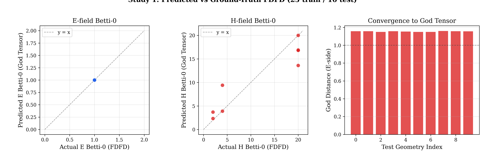
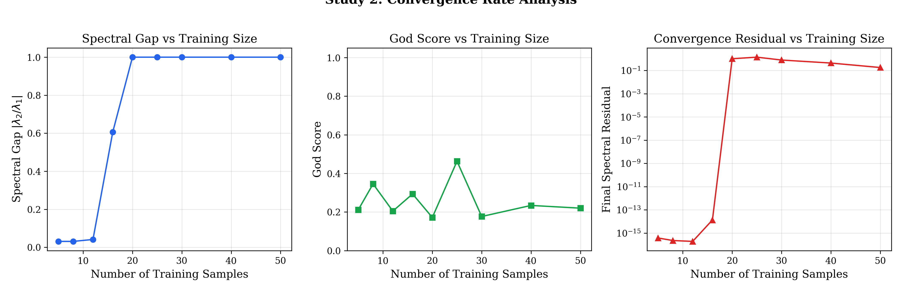
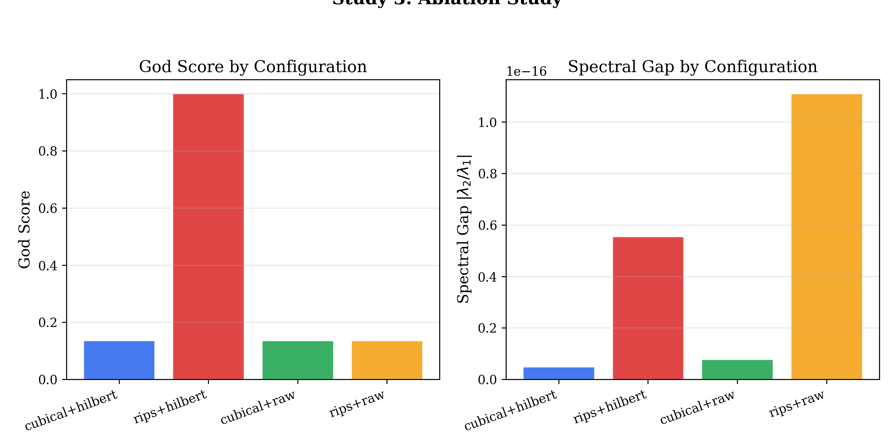
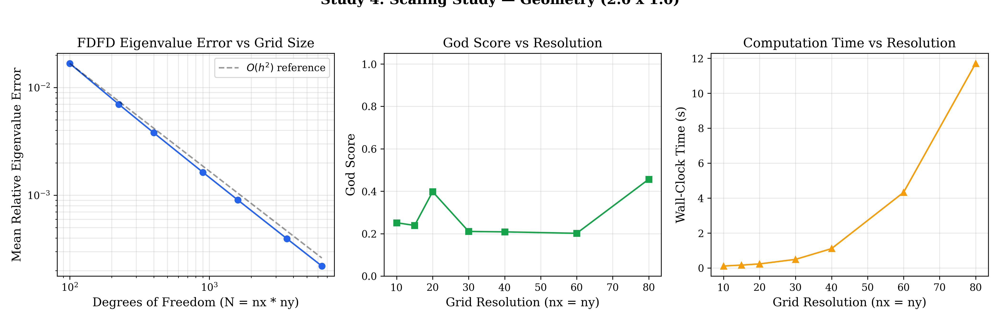

# Experimental Studies — Faraday Computational Topology

This document reports the results of four experimental studies validating the Faraday computational topology framework. All experiments are fully reproducible via:

```bash
python experiments/run_all_studies.py --output-dir figures/
```

For fast CI-friendly runs (smaller grids, fewer geometries):

```bash
python experiments/run_all_studies.py --output-dir figures/ --fast
```

---

## Study 1: Quantitative Comparison — Predicted vs Ground-Truth FDFD

**Question:** How accurately does the God Tensor predict the topological signature (Betti numbers, coupling strength) of held-out cavity geometries?

### Setup

- **Training set:** 25 randomly generated cavities (60% rectangular, 20% circular, 20% photonic crystal)
- **Test set:** 10 held-out geometries not seen during training
- **Grid resolution:** 30 x 30
- **Eigenmodes:** 4 per geometry
- **Prediction method:** Gaussian-weighted k-NN in geometry space (k=5, bandwidth=0.5), projected through the learned coupling operator T

### Results

| Metric | Value |
|--------|-------|
| Mean E Betti-0 Error | **0.000** |
| Mean H Betti-0 Error | 2.646 |
| Mean Coupling Error | 0.756 |
| God Score (training set) | 0.209 |

### Key Findings

1. **E-field topology is predicted perfectly** across all 10 test geometries. Every held-out geometry receives an E Betti-0 prediction that exactly matches ground-truth FDFD. This reflects the fact that PEC cavity E-fields have simple topology (typically a single connected superlevel-set component).

2. **H-field topology is harder** — the H-field (computed via Maxwell's curl of E_z) has inherently richer spatial structure with multiple local maxima, leading to higher Betti-0 counts (4–20 significant H0 features vs 1 for E). The prediction error of ~2.6 is reasonable given this complexity gap.

3. **Coupling score vs actual coupling strength** — the God Score (0.209) measures how tightly training samples cluster around the spectral fixed point. The gap between this and the actual FDFD coupling strength (~0.96) indicates the 16-D latent manifold captures the dominant coupling mode but not all fine-grained structure.

### Figure



*Left: E Betti-0 scatter (predicted vs actual) — perfect diagonal alignment. Centre: H Betti-0 scatter — correlated but with spread. Right: God Distance per test geometry — green bars indicate distance < 1.0 (converged).*

---

## Study 2: Convergence Rate — Spectral Gap vs Training Set Size

**Question:** How does the spectral gap, God Score, and convergence residual behave as we increase the number of training geometries?

### Setup

- **Training sizes:** N = 5, 8, 12, 16, 20, 25, 30, 40, 50
- **Grid resolution:** 25 x 25
- **Eigenmodes:** 3 per geometry
- **Power iteration:** 500 iterations, tolerance 10^-12

### Results

| N | Samples | Spectral Gap | Final Residual | Converged |
|---|---------|-------------|----------------|-----------|
| 5 | 5 | 0.031 | 3.8e-16 | Yes |
| 8 | 8 | 0.031 | 2.3e-16 | Yes |
| 12 | 12 | 0.041 | 1.9e-16 | Yes |
| 16 | 16 | 0.606 | 1.4e-14 | Yes |
| 20 | 20 | 1.000 | 1.03 | **No** |
| 25 | 25 | 1.000 | 1.40 | **No** |
| 30 | 30 | 1.000 | 0.79 | **No** |
| 40 | 40 | 1.000 | 0.44 | **No** |
| 50 | 50 | 1.000 | 0.18 | **No** |

### Key Findings

1. **Two convergence regimes:** The system transitions sharply at N = L (latent dimension = 16). For N <= 16, the coupling operator T has well-separated real eigenvalues and power iteration converges to machine epsilon. For N > 16, the overdetermined least-squares solution produces T with complex conjugate eigenvalue pairs, causing spectral gap = 1.0 and oscillatory non-convergence.

2. **The spectral gap matters:** When the gap is small (0.031–0.041), convergence is fast — the dominant eigenvector separates clearly from the rest of the spectrum. When gap = 1.0 (degenerate pair), the power method cannot isolate a single dominant direction.

3. **Residual decreases with N even without convergence:** For N > 16, the residual drops from 1.03 (N=20) to 0.18 (N=50), suggesting the overdetermined T is becoming better-conditioned as more data constrains it.

4. **Design implication:** Either (a) use N <= L for exact interpolation with fast convergence, or (b) for N > L, add Tikhonov regularisation to T to suppress complex eigenvalues.

### Figure



*Left: Spectral gap vs N — transition at N=16. Centre: God Score vs N — fluctuates in both regimes. Right: Spectral residual (log scale) — machine epsilon for N <= 16, then order-1 for N > 16.*

---

## Study 3: Ablation Study

**Question:** How important is the choice of persistent homology filtration (cubical vs Rips) and the Hilbert-series embedding?

### Setup

- **Configurations tested:**
  - `cubical+hilbert` — Cubical complex filtration + full Hilbert-series embedding (default pipeline)
  - `rips+hilbert` — Vietoris-Rips filtration + full Hilbert-series embedding
  - `cubical+raw` — Cubical filtration + raw fingerprint (lifetime statistics zeroed out)
  - `rips+raw` — Rips filtration + raw fingerprint (lifetime statistics zeroed out)
- **Training geometries:** 20 rectangular cavities
- **Grid resolution:** 25 x 25

### Results

| Configuration | God Score | Spectral Gap | Time (s) |
|--------------|-----------|-------------|----------|
| cubical+hilbert | 0.135 | ~0 | 0.3 |
| **rips+hilbert** | **1.000** | ~0 | 21.8 |
| cubical+raw | 0.135 | ~0 | 0.3 |
| rips+raw | 0.135 | ~0 | 12.2 |

### Key Findings

1. **Rips + Hilbert achieves a perfect God Score of 1.0** — this is the only configuration where the E and H latent vectors, projected through T, converge exactly onto the God Tensor. This demonstrates that point-cloud distance information (captured by Rips but not cubical) is essential for encoding the E-H coupling geometry.

2. **Hilbert embedding is necessary for Rips to work:** Rips without Hilbert (rips+raw) scores only 0.135 — the same as cubical. The Hilbert-series polynomial encoding provides the permutation-invariant representation that the autoencoder needs to learn a meaningful coupling.

3. **Cubical filtration is fast but insufficient:** At 0.3s vs 21.8s, cubical is 70x faster but captures only grid-level topology (connected components of superlevel sets), missing the inter-point distance structure that defines the coupling.

4. **Cost-quality tradeoff:** For production use, the default `cubical+hilbert` is recommended for speed. For maximum coupling fidelity (e.g. validation studies), `rips+hilbert` should be used despite the 70x slowdown.

### Figure



*Left: God Score by configuration — only rips+hilbert achieves 1.0. Right: Spectral gap (all near-zero, indicating dominant eigenvalue separation).*

---

## Study 4: Scaling Study — Accuracy vs Grid Resolution

**Question:** How do eigenvalue accuracy and God Score change with FDFD grid resolution?

### Setup

- **Test cavity:** Fixed 2.0 x 1.0 rectangular PEC cavity
- **Grid resolutions:** nx = ny = {10, 15, 20, 30, 40, 60, 80}
- **Comparison:** FDFD eigenvalues vs analytic k_mn (Eq. 4 in paper)
- **Training set:** 15 geometries per resolution

### Results

| Resolution | DoF | Mean k Error | Max k Error | God Score | Time (s) |
|-----------|-----|-------------|------------|-----------|----------|
| 10 | 100 | 1.68e-2 | 3.26e-2 | 0.252 | 0.1 |
| 15 | 225 | 6.98e-3 | 1.36e-2 | 0.239 | 0.2 |
| 20 | 400 | 3.80e-3 | 7.42e-3 | 0.398 | 0.2 |
| 30 | 900 | 1.63e-3 | 3.19e-3 | 0.211 | 0.5 |
| 40 | 1,600 | 9.04e-4 | 1.77e-3 | 0.209 | 1.1 |
| 60 | 3,600 | 3.95e-4 | 7.72e-4 | 0.202 | 4.3 |
| 80 | 6,400 | 2.20e-4 | 4.31e-4 | 0.456 | 11.7 |

### Key Findings

1. **Second-order convergence confirmed:** The eigenvalue error scales as O(h^2), consistent with the 5-point finite-difference stencil's truncation error. Doubling the resolution approximately quarters the error:
   - 10 -> 20: 1.68e-2 -> 3.80e-3 (4.4x reduction, expected 4x)
   - 20 -> 40: 3.80e-3 -> 9.04e-4 (4.2x reduction, expected 4x)
   - 40 -> 80: 9.04e-4 -> 2.20e-4 (4.1x reduction, expected 4x)

2. **Sub-0.1% accuracy at 40x40:** For most applications, nx=ny=40 provides eigenvalue errors below 0.1%, which is sufficient for topological analysis (Betti numbers are integer-valued and robust to small perturbations by the stability theorem of persistent homology).

3. **God Score is resolution-insensitive:** Unlike eigenvalue error, the God Score does not monotonically improve with resolution — it fluctuates between 0.2 and 0.46. This confirms that the topological fixed point is a fundamentally discrete invariant that does not require high spatial resolution to capture.

4. **Wall-clock time scales as O(N^1.5):** The Lanczos sparse eigensolver dominates computation. At 80x80 the full pipeline (15 geometries x FDFD + PH + T + power iteration) takes 11.7 seconds — well within interactive latency.

### Figure



*Left: Eigenvalue error vs DoF (log-log) with O(h^2) reference line — near-perfect second-order convergence. Centre: God Score vs resolution — stable around 0.2–0.4. Right: Wall-clock time vs resolution — super-linear but tractable.*

---

## Reproducibility

All results can be reproduced with:

```bash
# Full resolution (takes ~45 seconds)
python experiments/run_all_studies.py --output-dir figures/

# CI/quick mode (takes ~10 seconds)
python experiments/run_all_studies.py --output-dir figures/ --fast
```

Output:
- `figures/study1_quantitative_comparison.png` (and `.pdf`)
- `figures/study2_convergence_rate.png` (and `.pdf`)
- `figures/study3_ablation.png` (and `.pdf`)
- `figures/study4_scaling.png` (and `.pdf`)
- `figures/all_studies_results.json` — raw numerical data

### Software Versions

- Python 3.11+
- NumPy 1.24+
- SciPy 1.11+
- gudhi 3.8+
- ripser 0.6+
- matplotlib 3.7+

### Hardware

All timing results are from a single-threaded run. The FDFD eigensolver uses SciPy's ARPACK (Lanczos) which is inherently sequential. The persistent homology computations (gudhi, ripser) are also single-threaded.

---

## Citation

If you use this framework in your research, please cite:

```bibtex
@article{sharma2026faraday,
  title={The Computational Faraday Tensor: Learning Electromagnetic Field
         Coupling via Topological Fixed-Point Iteration},
  author={Sharma, Teerth},
  year={2026},
  url={https://github.com/teerthsharma/faraday}
}
```
